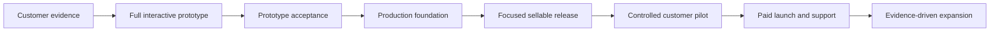

# Anumat development roadmap: complete prototype, then a sellable SaaS

Status: proposed delivery plan, not completed implementation. Updated 2 October 2026, Asia/Phnom_Penh.

Confirmed customer segment: Cambodian small and medium businesses using Khmer and English. The employee-count range, first industry, willingness to pay, and country rules remain discovery questions. This document deliberately provides completion gates instead of claiming that a calendar date makes a release ready.

## 1. Product direction and recommendation

Anumat is a modular operations and HR workspace. `/discover` is the app launcher; it is not an HR product by itself. Requests & approvals, Tasks, Meetings, and Surveys & evaluations provide shared collaboration capabilities. The eight HR apps now have connected local lifecycle prototypes. The detailed roadmap still includes broader policies, commercial surfaces, customer validation, and production work. See [implementation status](docs/roadmap/IMPLEMENTATION_STATUS.md) for the actual delivered scope and evidence.

The [HR SaaS series](https://chamrong.com/series/build-an-hr-saas-a-z) provides the lifecycle and commercial delivery reference. This roadmap adapts that reference to Anumat's actual React/Vite prototype. It does not imply that reading or following the series implements a product.

**Recommended sequence:** validate the customer → complete all twelve app prototypes and connected journeys → validate the prototype with customers → build a narrow production release → run a controlled pilot → sell and support it → expand from evidence.

**Recommended first paid package, subject to discovery:** Employee core + leave requests/approvals + onboarding tasks + basic permission-aware reports. Include workspace administration and real notifications. Tasks are a supporting HR workflow; do not position the first package as a full Jira competitor. Meetings and surveys can remain optional supporting capabilities.

A full prototype and a sellable first release have different scopes. Completing the twelve-app prototype does not require implementing twelve production modules before accepting the first paying customer. A prototype may support a paid discovery engagement, but it must not be sold as a live employee system.

## 2. Current state and gaps

Evidence: `PRODUCT.md`, actual routes in `src/App.tsx`, launcher in `src/pages/Discover.tsx`, domain/store code, and the Storybook created for this project. This is a repository inventory; it is not evidence of customer validation, legal review, or a production security assessment.

| Area | What exists | What must be completed |
| --- | --- | --- |
| Workspace and launcher | Workspace switching, remembered app entry, app identity, Khmer/English, themes/mobile | Role-based landing surfaces, coherent first-use setup, module availability/entitlement demo |
| Requests & approvals | Request editing, sequential conditions, forms, history, route simulation | Leave balance domain, version snapshots, delegation/resubmission/cancellation design, decision versus execution |
| Tasks | Rich editor, priorities, hierarchy, sprints, RACI, DoR/DoD, sign-off | HR task templates, linked employee/onboarding plans, blocker and evidence review journeys |
| Meetings | Scheduling, attendees, decisions and follow-up tasks | Demonstrate scheduling conflict, reschedule/cancellation, restricted decisions and end-to-end follow-through |
| Surveys | Conditional questions, audiences, anonymous/named responses and results | Evaluation closure and follow-up journey, small-cohort privacy review, evidence/permission states |
| App people/roles | Isolated Admin/Member/Viewer, invitation preview, task assignment guards | Workspace/account versus employee identity, field/scope permissions, joiner/mover/leaver access lifecycle |
| Notifications | Personal in-app/email/Telegram preferences, local previews | Event coverage, retry/failure UX, account verification and delivery contracts |
| Storybook | 230 examples including HR; desktop/mobile rendering checks | Extend for every new HR domain and connected flow; present checks are not full domain correctness coverage |
| Employee / recruitment / attendance / payroll / performance / training / assets / reports | Connected local lifecycle prototypes, isolated membership/scopes, history and reports | Complete remaining detailed backlog and customer acceptance; no commercial readiness claim |
| Authentication, database, files, jobs, billing, operations | Browser previews/local storage | Real identity, tenant-safe server enforcement, durable storage/jobs, private files, billing and recovery |

## 3. Customer outcomes and surfaces

| Persona | Outcome | Allowed scope | Important restriction |
| --- | --- | --- | --- |
| Business owner / company admin | Configure the company and understand workforce operations | Own company, granted modules | Ownership does not automatically justify unrestricted access to all HR fields |
| HR administrator | Maintain accurate employee records and controlled changes | Granted branches/teams and HR fields | Sensitive compensation and identity access requires explicit permission |
| Manager | Approve leave, review staff, finish onboarding handoffs | Assigned team/effective reporting relationship | No unrestricted employee directory dossiers or payroll exports |
| Employee | View own records, submit requests, complete assigned actions | Own record plus shared permitted content | Cannot approve own controlled HR change or edit verified fields directly |
| Recruiter / interviewer | Move applications and document assessments | Assigned vacancies/applicants | Interviewer must not see unrelated candidates or restricted offer compensation |
| Finance / payroll reviewer | Review approved period inputs and exports | Granted periods, employees, fields | Preparer and independent approver separation for sensitive release |
| SaaS operator | Support tenants and manage subscriptions | Platform metadata and approved support access | No silent browsing or editing of employee dossiers |

These are logical surfaces in one product, not a requirement for five codebases. The same person can hold several roles. App access, team/branch scope, field access, and RACI responsibilities are independent permission dimensions.

## 4. Delivery gates

| Gate | Required evidence | Decision owner |
| --- | --- | --- |
| G0: scope ready | Named customer pain, first paid package hypothesis, scope/non-goals, acceptance map | Founder/product owner |
| G1: prototype complete | Twelve bounded app flows, connected lifecycle, role/error states, all mandatory prototype criteria pass | Product owner + UX + engineering |
| G2: production build approved | Prototype usability evidence, agreed production scope, permission/field model, architecture and cost decisions | Product owner + technical lead |
| G3: safe pilot ready | Real identity/storage/authorization, reconciled imports, tested backups, release evidence and support owner | Engineering + pilot HR owner |
| G4: first paid release ready | Successful real scoped workflow, accepted outcome measurements, agreed price/terms/support, no blocking defects | Founder + customer decision maker |
| G5: expand | Repeat use, retention and support economics; customer evidence for next module | Product/commercial/engineering |

G1 must pass before replacing the browser prototype with a production implementation. Customer research can run throughout prototype development; real employee data and operational decisions must wait for G3.

## 5. Track A — prototype first

All features in this track use fictional data and local/mock adapters. Money, statutory calculations, email, Telegram, signatures, bank transfers, and attendance device integrations are simulations with explicit labels.

| Phase | Outcome and work | Required deliverables | Exit gate | Dependencies |
| --- | --- | --- | --- | --- |
| P0 — Customer and product contract | Interview proposed buyers/users; map their current spreadsheets, messages and approvals; choose the first paid workflow | Evidence log, personas, journey map, package hypothesis, must/should/later scope, demo scenarios | At least 5 interviews across at least 3 firms; at least 2 firms confirm the same recent costly problem; record disagreements and revise scope | None |
| P1 — Shared domain and UX foundation | Design company/branch/department/position, account versus employee, memberships, permission scopes, histories, field dictionary, independent statuses | Entity map, permission matrix, field catalogue, fixture strategy, reusable patterns, app setup/operator/self-service navigation | Core references resolve; role and sensitive-field examples are testable; no business object is forced into an ambiguous generic status | P0 |
| P2 — Finish four existing apps | Complete bounded approvals/tasks/meetings/survey journeys; add version/evidence/error states and domain links | Existing app gap tickets, request snapshots, HR task templates, connected demo scenarios and stories | All selected journeys include create → review → complete → history plus recovery paths | P1 |
| P3 — Employee core and leave | Directory and personnel overview; separate employment episodes/assignments; changes/probation/offboarding/rehire; leave policy and ledger | Employee/self-service screens, history, import preview, leave/calendar/balance states | Approved change is applied at the correct effective date; denied/withdrawn leave does not consume balance; rehire preserves history | P1–P2 |
| P4 — Recruitment, onboarding and attendance | JD/requisition → vacancy → applications → interview → offer → hire; linked onboarding plan; shifts/time/corrections/period close | Recruitment board/details, assessments, offer revisions, hire conversion, attendance exception views | Hire creates one employment episode and one owned plan; attendance corrections require review and preserve originals | P3 |
| P5 — Payroll preview, performance and training | Payroll-ready period snapshot/export simulation; goals/reviews; learning/enrollment/feedback | Restricted payroll preview/payslip sample, review cycles, training completion evidence | Approved period is frozen; appraisal results are distinct from survey feedback; enrollment alone is not completion | P3–P4 |
| P6 — Assets, reporting and commercial surfaces | Custody/reservations/maintenance/return; permission-aware reports; plan/trial/entitlement/operator demos | Asset register/handover, report export states, pricing/package comparison, trial/billing/operator previews | Offboarding discovers unreturned assets; report respects scope; planned/live/trial/locked states are honest | P3–P5 |
| P7 — Connected acceptance and customer demos | Test end-to-end lifecycle, isolation/privacy, Khmer/mobile, recovery and stakeholder usability | Acceptance evidence, expanded Storybook, feedback/decision register, recorded demo script, production handoff | G1 and G2 pass; failed criteria are fixed or explicitly removed from agreed scope | P0–P6 |

No phase is completed simply because its menu/card exists. A module requires a usable object model, owned actions, meaningful states, history, errors, and a complete bounded flow.

### Prototype sequencing and estimates

Planning assumption only: one full-time frontend engineer, a part-time product/UX owner, and accessible customer reviewers. Indicative elapsed ranges are P0 1–2 weeks, P1 1–2, P2 2–4, P3 3–5, P4 3–5, P5 3–5, P6 2–3, P7 2–3. Sequential total: approximately **17–29 weeks**. Some work can overlap after domain boundaries stabilize. These are coarse planning ranges, not commitments or measured throughput; re-estimate after P1 and the first finished module. Existing prototype code reduces repeated UI work but does not remove domain design or usability testing.

Use configurable one- or two-week delivery sprints. Each sprint closes complete user journeys rather than completing the UI for every module simultaneously. Put unready stories in the backlog; show a demo, evidence, and unresolved risks at each sprint review.

## 6. Prototype scope per app

Detailed tickets and field/state requirements are in [the prototype backlog](docs/roadmap/PROTOTYPE_BACKLOG.md).

| App | Minimum complete prototype flow | Key dependencies | First commercial priority |
| --- | --- | --- | --- |
| Requests & approvals | Configure form/route → submit → approve/return/decline → execute/record result → history | Versioned definitions, permissions, employee/leave data | Core |
| Tasks | Epic/story/task → assign RACI → sprint → readiness → delivery → evidence → sign-off | People, links, status policies | Core for HR handoffs |
| Meetings | Plan → participants → agenda → decisions → assigned actions → follow-up | App membership, Tasks | Supporting |
| Surveys & evaluations | Build → audience/privacy → publish → respond → close → results/action | People/scopes, privacy thresholds | Supporting |
| Employee management | Create/import → activate → controlled change → probation → offboard → rehire | Organization, private-field policy, approvals/tasks | Core |
| Recruitment | JD/requisition → approved vacancy → applicant → interview → approved offer → hire | Positions, approvals, employee episodes, tasks | Next paid add-on unless discovery prioritizes it |
| Attendance | Assign shift → capture time → exception → correction → approve → close period | Employee, calendar/leave, reviewer scopes | Next paid add-on |
| Payroll | Review approved inputs → reconcile → freeze → independent review → export/payslip simulation | Employee/compensation, attendance/leave, exact money | Payroll-ready exports first; engine/payments later |
| Performance | Cycle → goals → self review → manager review → calibration → acknowledge → development | Employee/manager history, evidence and Tasks | Later add-on |
| Training | Course/session → enrollment → attendance → assessment → evidence → evaluation | Employee, Tasks, Meetings, Surveys | Later add-on |
| Assets management | Register → assign/reserve → handover → maintain → return → retire | Employee/custody, Tasks, offboarding | Later add-on |
| Report management | Choose definition/scope/period → preview → reconcile → export → history | Read models and permissions from each source app | Basic core; cross-app advanced later |

Leave belongs to Employee core and uses Requests & approvals; onboarding/offboarding are connected workflows rather than extra disconnected apps. Shared rooms remain reservable resources within Assets. Surveys collect feedback; Performance owns formal review cycles and authorized outcomes.

## 7. Required connected journeys

1. **New hire:** approved position/JD → vacancy → application/interview → approved offer revision → accepted offer → authorized hire → employment episode → manager/IT/HR onboarding tasks → equipment custody → training evidence → probation review.
2. **Existing employee:** import preview → resolve errors/duplicates → reconcile records → activate employment → establish manager/app access; do not invent recruitment history.
3. **Leave:** employee checks balance → submits dates → manager reviews → approved reservation/usage policy → attendance calendar reflects leave → payroll-ready input uses correct period → cancellation/amendment preserves ledger history.
4. **Employment change:** propose transfer/promotion/compensation change → independent approval → effective-date application → history → downstream attendance/reviewer/payroll scope refresh; approval and execution appear separately.
5. **Delivery and learning:** meeting decision → task with acceptance criteria/RACI → sprint → evidence/sign-off → training/development follow-up where appropriate.
6. **Offboarding/rehire:** approved separation → owned handover/access/asset tasks → review final inputs → close employment episode → retain scoped history → rehire under a new episode without restoring old access silently.

Every handoff needs its source reference, responsible actor, expected outcome, success state, failure/retry state, and history entry. Cross-app links do not grant extra permissions.

## 8. Track B — production after prototype acceptance

The prototype stays React/Vite during Track A. Use an architecture decision record at G2 to select the production implementation. The series' Next.js modular application with PostgreSQL, private storage and durable jobs is a sensible candidate, not an instruction to migrate now. Reuse verified UI/domain contracts and replace the browser store behind explicit adapters. Do not move tenancy enforcement into the client.

| Phase | Deliverables | Completion evidence |
| --- | --- | --- |
| D0 — Architecture and release contract | Frozen v1 scope, repository/runtime decision, domain boundaries, threat/data-flow model, cost/capacity assumptions, module entitlement policy | Reviewed architecture decision and mapped prototype-to-production gaps; infrastructure choices tied to requirements |
| D1 — Secure platform foundation | Verified identity/invitations, tenant resolution, server action/scope/field authorization, transactions/migrations, private file access, audit separation, outbox/jobs, environments/CI, observability and backup/restore | Cross-tenant and unauthorized access tests pass; restore drill restores verified records/files; secrets and test data cannot enter customer environment |
| D2 — First sellable vertical slice | Employee core, leave ledger/approvals, onboarding tasks, scoped reports, reconciled imports, durable notifications | Real multi-user workflows pass concurrency, retry, permissions, version and reversal tests; sample employee/leave data reconcile |
| D3 — Commercial and pilot readiness | Actual subscriptions or a documented manual invoicing model, trial/entitlement enforcement, support/contact/terms/privacy, customer data export/deletion workflow, training and onboarding runbooks | G3 passes; package accurately reflects working features; named owners for incidents, customer onboarding and support |
| D4 — Controlled pilot | One initial company before parallel pilots; agreed data migration/scope/scorecard; employee and manager training; feedback triage; safe exit plan | Weekly evidence of real use and correctness; blockers resolved; customer accepts import reconciliation and paid continuation or exit |
| D5 — Paid launch and operation | Price/package agreement, truthful demo/site, support commitments, monitored billing, renewals, release management, feedback and demand register | G4 passes; repeatable onboarding, successful invoice collection and real workflow outcomes; no unsupported SLA or compliance claims |
| D6 — Expansion | Recruitment/attendance/payroll-ready add-ons prioritized by demand; performance/training/assets/advanced reports later | G5; module-specific acceptance, training and support costs justified by usage/revenue/customer commitments |

Production duration cannot be committed from a prototype inventory alone. Estimate D0–D3 after G2 using the agreed team, integrations, operational coverage and security scope. A real-data pilot is production use and requires G3 even when called “beta.”

### Production invariants

- A tenant-scoped identifier cannot be used to read/write another company, including files, jobs, reports, caches and exports.
- App membership plus action, organizational scope and field permission determine access; UI hiding is not authorization.
- Approvals bind to the submitted revision. Changes invalidate or create a new review according to an explicit policy.
- Approved and applied are independent states; effective-dated changes are not silently immediate.
- Duplicate/retried hire, leave ledger adjustment, export or job execution cannot create duplicate effects.
- Employee person/account/employment records remain distinct; separation and rehire retain appropriate history and require reviewed access.
- Public activity, HR business history, security audit, and integration/job history are not interchangeable logs.
- Exact monetary values, currency, period snapshots and reviewed rule versions prevent historical payroll changing under current configuration.
- Restricted documents have scoped access, quarantine/verification states and expiring access where appropriate.
- Current country policy, payroll/tax/social-contribution requirements and permitted processing purposes need qualified review before claiming support; this roadmap supplies no legal rates or compliance certification.

## 9. Commercial plan and success measurements

These are proposed experiment targets, not forecasts. Confirm baselines and targets with the pilot customer.

| Stage | Measurement | Proposed target/gate |
| --- | --- | --- |
| Discovery | Repeated, recent costly workflow and named buyer | P0 evidence gate; capture hours/delay/error examples and ability to buy |
| Prototype | Completion of essential scenario without facilitator intervention | At least 5 representative participants spanning HR, managers and employees; at least 80% complete each critical scenario; resolve all blocking misunderstandings |
| Activation | Configured tenant + reconciled import + first employee access + first real request approved | Achieved within 7 working days after required customer data/configuration are accepted |
| Pilot | Weekly completed core workflows, unresolved data defects, customer-reported outcome | 4–6 week pilot; zero unresolved unauthorized exposure or financial/balance correctness defects; agree measurable improvement from baseline |
| Paid continuation | Buyer decision and documented reason | Aim for at least 2 willing pilot customers before expanding acquisition; track refusal as evidence, not failure to hide |
| Operation | Active tenants, workflow use, support hours/company, incident recovery and delivery failures | Establish actual baseline during pilot; set commitments from demonstrated capacity |
| Retention | Renewals, module adoption, churn reasons, revenue retained | Review monthly; expansion depends on recurring value rather than number of registered accounts |

Test package/pricing with buyers rather than inventing a market price. Compare subscription, onboarding/import work, training, support, storage/delivery and integration costs. If manual invoicing is used first, define owner, payment confirmation, access grace period and reconciliation; do not build a fake checkout that implies a real payment.

## 10. Risk and decision register

| Risk / open decision | Impact | Mitigation and owner |
| --- | --- | --- |
| Twelve apps delay customer value | High | Complete bounded prototypes, freeze paid v1 scope, limit revisions; product owner |
| HR/accounts/app roles conflated | High | Distinct entities and permission tests; domain/technical lead |
| Payroll scope mistaken for full compliance/payments | High | Separate input export, calculation, payment and filing tiers; finance reviewer + product owner |
| Data history or balances overwritten | High | Effective dating, revision snapshots, ledgers, reversals and reconciliation; engineering + HR |
| Anonymous results identify small groups | High | Restrict views/exports, test cohort cuts, document threshold limits; product/privacy reviewer |
| Prototype delivery/security mistaken for real service | High | Clear preview labels and gate register; product/commercial owner |
| Customer imports are inaccurate | High | Mapping, row errors, duplicate resolution and per-record reconciliation; onboarding owner |
| Integrations fail or return uncertain outcomes | High | Durable jobs, retry/idempotency/status and reconciliation designs; engineering |
| Khmer/phone UX blocks adoption | Medium/high | Role-based observed scenarios on actual devices; UX owner |
| Market, price or operating budget unvalidated | High | Discovery evidence and cost-to-serve ledger before commitments; founder |
| Framework migration consumes UI budget | Medium | Keep Vite prototype; decide production architecture only at G2; technical lead |

Open decisions before G0: first industry, buyer, core workflow priority, expected branch/company complexity. Before G2: v1 integrations, hosting/identity/runtime, permitted field collection, reviewed Cambodian policy scope, support coverage, pricing model. Before payroll expansion: export provider/format, calculation responsibility and independent reviewer.

## 11. Delivery governance and next sprint

Use Epic → Story → Task/Bug/Subtask for delivery planning; name an owner and acceptance evidence for every ticket. Separate product app permissions from delivery RACI.

A story is Ready when persona/outcome, fields, access/scope, transitions, at least three acceptance criteria, one negative/recovery path, fixtures and dependencies are agreed. Prototype Done means criteria pass locally, history/permissions and mobile/Khmer states are demonstrated, Storybook/docs are updated, and mock limitations are truthful. Production Done additionally requires durable/server controls, operational evidence and release-specific integration checks.

**Next sprint: P0/P1, not payroll implementation.**

1. Record 5 customer interviews and select one primary workflow/industry hypothesis.
2. Freeze the twelve prototype app boundaries and first paid package hypothesis.
3. Define the organization, employee/account/employment and permission model.
4. Create the field dictionary and three role-based fixture companies, using fictional records.
5. Add Employee overview, manager team and employee self-service wireframes/stories.
6. Close the existing-app critical gaps needed by Employee/leave before opening additional modules.

Progress is reported as planned → ready → building → acceptance → accepted. A partially implemented app never becomes “complete” by relabeling a launcher card.

## 12. Reference mapping

The source series has seventeen parts numbered 0–16. Anumat uses P0–P7 for prototype delivery and D0–D6 for commercialization; these are different numbering systems.

| Series phases | Anumat application |
| --- | --- |
| 0–2: direction, validation and UX | P0–P1, bounded prototype scope and acceptance |
| 3–6: stack, architecture, fields and engineering foundation | P1 domain design; actual infrastructure at D0–D1 |
| 7–9: recruitment, employee operations and integrations | P3–P6 prototype; prioritized implementation D2/D6 |
| 10–11: security and release evidence | Permission/error design in every P phase; enforced and evidenced D1–D3 |
| 12: onboarding and pilot | D3–D4 |
| 13–14: market experiments and first customers | Discovery alongside P0–P7; paid product decisions D4–D5 |
| 15–16: operation and growth | D5–D6; technology changes follow demonstrated demand |

Especially relevant source explanations: [product UX](https://chamrong.com/articles/hr-saas-product-requirements-ux-design), [architecture boundaries](https://chamrong.com/articles/hr-saas-architecture-tenancy-rbac-audit), [field modelling](https://chamrong.com/articles/hr-saas-database-domain-model), [recruitment handoff](https://chamrong.com/articles/hr-saas-recruitment-onboarding-workflow), [employee operations](https://chamrong.com/articles/hr-saas-employee-leave-attendance-performance), [payroll responsibility](https://chamrong.com/articles/hr-saas-integrations-reporting-payroll), [pilot delivery](https://chamrong.com/articles/hr-saas-deployment-migration-beta-pilot), and [first customer strategy](https://chamrong.com/articles/hr-saas-pricing-go-to-market-first-customers).

Implementation detail: [prototype backlog](docs/roadmap/PROTOTYPE_BACKLOG.md). Release evidence: [prototype acceptance matrix](docs/roadmap/PROTOTYPE_ACCEPTANCE.md). Current UI catalogue: [Storybook guide](STORYBOOK.md).

## SME customer journey implemented in the prototype

Customers can compare three starting points, create an empty company, resume setup, and follow progress from saved records. The sales enquiry is explicitly a local draft with copy/email handoff. The default starting point is Approvals & tasks; People & HR remains an equally selectable option. Validate the paid vertical slice with buyers before choosing between these packages; the HR production sequence above is a hypothesis, not a commitment created by a radio selection.

| Launch requirement | Acceptance evidence before a live sale |
| --- | --- |
| Identity and company isolation | Real users sign in; server checks tenant and app permissions on every operation; cross-company access tests pass |
| Shared workflow correctness | Two users complete the selected workflow with durable records, concurrent edits, rejected actions, and attributable history |
| Recovery and ownership | Restore a tested backup; customer can export their data; named incident and support owners |
| Notifications and invitations | Acceptance uses authenticated identities; delivery failures are visible and retryable; no local-only invitation is presented as sent |
| Honest commercial offer | Buyer agrees working scope, price, deployment responsibility and support; configured contact channels are verified |
| Usable onboarding | SME users complete setup and the first core workflow on phone and desktop in Khmer or English; record confusion and revise from evidence |

Do not accept real employee records or promise production hosting based on this browser-only prototype. Use it to review workflows and agree a bounded pilot after the production gates pass.
